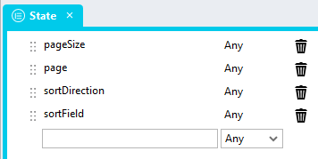
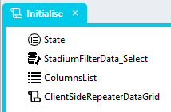
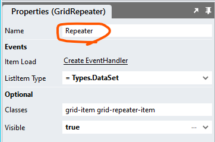
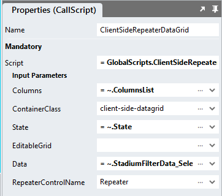
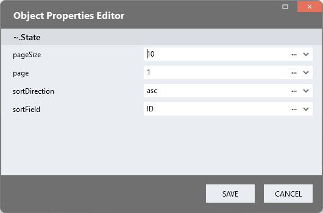

# Client-Side Repeater DataGrid <!-- omit in toc -->

## Contents <!-- omit in toc -->
- [Version](#version)
- [Setup](#setup)
  - [Database](#database)
  - [Application Setup](#application-setup)
  - [Global Scripts](#global-scripts)
    - [ClientSideRepeaterDataGrid Script](#clientsiderepeaterdatagrid-script)
    - [ClientSideRepeaterDataGridState Script](#clientsiderepeaterdatagridstate-script)
  - [Types](#types)
    - [Column](#column)
    - [State](#state)
    - [DataSet](#dataset)
  - [Page](#page)
    - [Container](#container)
    - [Grid](#grid)
    - [Repeater](#repeater)
    - [Labels](#labels)
  - [Page Scripts](#page-scripts)
    - ["Initialise" Page Script](#initialise-page-script)
    - ["Initialise" Setup](#initialise-setup)
  - [Page.Load Event Handler](#pageload-event-handler)
  - [CSS Files](#css-files)
  - [Styling Customisations](#styling-customisations)
- [Working with Stadium Repos](#working-with-stadium-repos)

## Overview
Using a *Repeater* control to display data allows for more flexibility, customisability and extensbility than a standard DataGrid. This module provides the functionality to sort and page through a DataSet assigned to a *Repeater*. 

Examples are also provided on how to achieve a variety of other common DataGrid functions. 

https://github.com/user-attachments/assets/c6d7890c-16b5-456d-a71e-f92b6a701da3

### Example Application
The repo includes the sample application shown in the video:

[Client-Side-Repeater-DataGrid.sapz](Stadium6/Client-Side-Repeater-DataGrid.sapz?raw=true)

# Version
1.1 Added an optional callback parameter for a page script that can be called after the assignment of the data

1.2 Added "Classic" paging option; added "No data" display for empty datasets

# Setup

## Database
[Follow these instructions](database-setup.md) to set up the "FilterData" database. Then add a connector called "StadiumFilterData". 

## Application Setup
1. Check the *Enable Style Sheet* checkbox in the application properties

## Global Scripts
The module requires the script called ["ClientSideRepeaterDataGrid"](#ClientSideRepeaterDataGrid-script) below to set up the *Repeater* contol as a DataGrid. 

In order to query the state of the *Repeater*, the second script called ["ClientSideRepeaterDataGridState"](#ClientSideRepeaterDataGridstate-script) is also needed. This is useful if you, for example, want to return the *Repeater* to a specific state later. 

### ClientSideRepeaterDataGrid Script
1. Create a Global Script called "ClientSideRepeaterDataGrid"
2. Add the input parameters below to the Global Script
   1. Columns
   2. ContainerClass
   3. Data
   4. EditableGrid
   5. RepeaterControlName
   6. State
   7. PagingType
3. Drag a *JavaScript* action into the script
4. Add the Javascript below into the JavaScript code property
```javascript
/* Stadium Script v1.2 https://github.com/stadium-software/repeater-datagrid-client-side */
let scope = this;
let data = ~.Parameters.Input.Data || [];
let cols = ~.Parameters.Input.Columns || [];
let editMode = ~.Parameters.Input.EditableGrid || false;
let state = ~.Parameters.Input.State || {};
let callback = ~.Parameters.Input.Callback;
let pageSize = parseInt(state.pageSize);
let sortField = state.sortField || cols[0].name;
let sortDirection = state.sortDirection || "";
let pagingType = ~.Parameters.Input.PagingType || "default";
let page = parseInt(state.page) || 1;
let pagers = 10;
let totalRecords = data.length;
let repeaterName = ~.Parameters.Input.RepeaterControlName;
if (isNaN(page)) page = 1;
let totalPages = Math.ceil(totalRecords / pageSize);
let containerClass = ~.Parameters.Input.ContainerClass;
if (!containerClass) {
     console.error("The ContainerClass parameter is required");
     return false;
}
let container = document.querySelectorAll("." + containerClass);
if (container.length == 0) {
    console.error("The class '" + containerClass + "' is not assigned to any container");
    return false;
} else if (container.length > 1) {
    console.error("The class '" + containerClass + "' is assigned to multiple containers");
    return false;
}
container = container[0];
container.classList.add("stadium-client-side-dg-repeater");
let grid = container.querySelectorAll(".grid-layout");
if (grid.length == 0) {
    console.error("The container '" + containerClass + "' must contain a Grid control");
    return false;
} else if (grid.length > 1) {
    console.error("The container '" + containerClass + "' must contain only one Grid control");
    return false;
} else { 
    grid = grid[0];
}
let contID = container.id;
let cellsPerRow = cols.length;
if (document.getElementById(contID + "_stylesheet")) document.getElementById(contID + "_stylesheet").remove();
attachStyling();
addHeaders(cols);
if (!editMode) {
    addPaging();
}
sort(sortField, sortDirection);
let cells = container.querySelectorAll(".grid-repeater-item");
let rowNo = 1, cellCounter = 0;
for (let i = 0; i < cells.length; i++) {
    cellCounter++;
    cells[i].setAttribute("row-no", rowNo);
    if (cellCounter >= cellsPerRow) {
        cellCounter = 0;
        rowNo++;
    }
}
/*----------------------------------------------------------------------------------------------*/
async function setRepeaterData(p, d) {
    let first = (p - 1) * pageSize;
    let pageData = d.slice(first, first + pageSize);
    attachData(pageData);
    writeCookie();
    if (callback) await scope[callback](d);
}
function attachData(value) {
    scope[`${repeaterName}List`] = value;
    let noDataMsg = document.querySelector(".no-data-msg");
    if (value.length == 0 && !noDataMsg) {
        let noDataDiv = document.createElement("div");
        noDataDiv.classList.add("no-data-msg");
        noDataDiv.innerHTML = "No data to display.";
        document.querySelector(".paging-stack-layout").appendChild(noDataDiv);
    } else if (noDataMsg && value.length > 0) {
        noDataMsg.remove();
    }
}
function writeCookie() {
    let value = JSON.stringify({
        "pageSize": pageSize,
        "page": page,
        "sortDirection": sortDirection,
        "sortField": sortField
    });
    let options = {
        secure: true,
        samesite: "strict",
        domain: window.location.hostname,
    };
    let updatedCookie = encodeURIComponent(contID) + "=" + encodeURIComponent(value);
    for (let optionKey in options) {
        updatedCookie += "; " + optionKey;
        let optionValue = options[optionKey];
        if (optionValue !== true) {
            updatedCookie += "=" + optionValue;
        }
    }
    document.cookie = updatedCookie;
}
function addHeaders(c) { 
    let headers = container.querySelectorAll(".repeater-header");
    for (let i = 0; i < headers.length; i++) {
        headers[i].remove();
    }
    for (let i = c.length-1; i > -1; i--) {
        let gItem = createTag("div", ["grid-item", "repeater-header"], []);
        let el = createTag("div"), inner;
        if (c[i].header && c[i]?.sortable !== false && c[i]?.sortable !== "false" && !editMode) {
            el = createTag("div", ["control-container", "link-container"]);
            inner = createTag("a", ["btn", "btn-lg", "btn-link"], [{name: "rel", value:"noopener noreferrer"}, {name: "field", value:c[i].name}], c[i].header);
            inner.addEventListener("click", handleSort);
            el.appendChild(inner);
        } else if (c[i].header) { 
            el = createTag("div", ["control-container", "label-container"]);
            inner = createTag("span", [], [], c[i].header);
            el.appendChild(inner);
        }
        if (c[i]?.visible == false || c[i]?.visible == 'false') el.classList.add("visually-hidden");
        if (c[i].name == sortField && sortDirection.toLowerCase() == "asc") el.classList.add("dg-asc-sorting");
        if (c[i].name == sortField && sortDirection.toLowerCase() == "desc") el.classList.add("dg-desc-sorting");
        gItem.appendChild(el);
        grid.insertBefore(gItem, grid.firstChild);
    }
}
function addPaging() { 
    if (container.querySelector(".paging")) container.querySelector(".paging").remove();
    let pagingContainer = createTag("div", ["layout-control", "container-layout", "paging", "inline-block-element"], []);
    if (pagingType.toLowerCase() == "classic") {
        let pagingButtonsContainer = createTag("ul", ["pagination"], []);
        let pagingButtons = addClassicPagingButtons(pagingButtonsContainer, page);
        pagingContainer.appendChild(pagingButtons);
    } else {
        let prevButtonContainer = createTag("div", ["control-container", "button-container", "previous-button"], []);
        let prevButton = createTag("div", ["btn", "btn-lg", "btn-default"], [], "<<");
        let nextButtonContainer = createTag("div", ["control-container", "button-container", "next-button"], []);
        let nextButton = createTag("div", ["btn", "btn-lg", "btn-default"], [], ">>");
        let goInputContainer = createTag("div", ["control-container", "text-box-container", "specific-page"], []);
        let goInput = createTag("input", ["form-control", "error-border", "text-box-input", "specific-page-input"], [{name: "type", value: "text"}]);
        let goButtonContainer = createTag("div", ["control-container", "button-container", "specific-page-go"], []);
        let goButton = createTag("div", ["btn", "btn-lg", "btn-default"], [], "Go");
        let pageInfoContainer = createTag("div", ["control-container", "label-container", "page-info"]);
        let pageInfo = createTag("span", [], [], getPageLabel());
        if (page == 1 || data.length == 0) prevButtonContainer.classList.add("disabled");
        if (page == totalPages || data.length == 0) nextButtonContainer.classList.add("disabled");
        prevButtonContainer.appendChild(prevButton);
        nextButtonContainer.appendChild(nextButton);
        goInputContainer.appendChild(goInput);
        goButtonContainer.appendChild(goButton);
        pageInfoContainer.appendChild(pageInfo);

        pagingContainer.appendChild(prevButtonContainer);
        pagingContainer.appendChild(nextButtonContainer);
        pagingContainer.appendChild(goInputContainer);
        pagingContainer.appendChild(goButtonContainer);
        pagingContainer.appendChild(pageInfoContainer);

        prevButton.addEventListener("click", function(){
            handlePaging("previous");
        });
        nextButton.addEventListener("click", function(){
            handlePaging("next");
        });
        goButton.addEventListener("click", function(){
            handlePaging("go");
        });
        goInput.addEventListener("keypress", function (e) {
            if ((e.keyCode < 48 || e.keyCode > 57)) {
                e.preventDefault();
            }
            if (e.keyCode === 13) {
                handlePaging("go");
            }
        });
    }
    let stackLayout, allStacks = container.querySelectorAll(".stack-layout-container");
    for (let i = 0; i < allStacks.length; i++) {
        if (allStacks[i].contains(grid) && allStacks.length > i) {
            stackLayout = allStacks[i + 1];
        }
    }
    if (!stackLayout) {
        stackLayout = createTag("div", ["stack-layout-container"]);
        container.appendChild(stackLayout);
    }
    stackLayout.classList.add('paging-stack-layout');
    stackLayout.insertBefore(pagingContainer, stackLayout.firstChild);
}
function handlePaging(tp) { 
    let nextBtn = container.querySelector(".next-button"),
        prevBtn = container.querySelector(".previous-button"),
        goInpt = container.querySelector(".specific-page-input"),
        pageInfo = container.querySelector(".page-info span"),
        fire = false;
    if (tp == "next" && page < totalPages) {
        page++;
        fire = true;
    }
    if (tp == "previous" && page > 1) {
        page--;
        fire = true;
    }
    if (tp == "go" && goInpt.value) {
        let pgVal = goInpt.value;
        goInpt.value = "";
        if (!isNaN(pgVal) && pgVal >= 1 && pgVal <= totalPages) {
            page = parseInt(pgVal);
            fire = true;
        }
    }
    if (fire) {
        nextBtn.classList.remove("disabled");
        prevBtn.classList.remove("disabled");
        if (page == 1) prevBtn.classList.add("disabled");
        if (page == totalPages) nextBtn.classList.add("disabled");
        pageInfo.textContent = getPageLabel();
        setRepeaterData(page, data);
    }
}
function addClassicPagingButtons(parent, currentPage) {
    currentPage = currentPage - 1;
    let firstPage = currentPage - (currentPage % 10);
    let lastPage = firstPage + pagers;
    parent.innerHTML = "";
    if (totalPages < lastPage) lastPage = totalPages;
    if (firstPage >= pagers) {
        let pagingButton = createTag("li", [], []);
        let pagingButtonInner = createTag("a", [], [], "«");
        pagingButtonInner.addEventListener("click", handleClassicPaging);
        pagingButton.appendChild(pagingButtonInner);
        parent.appendChild(pagingButton);
    }
    for (let i = firstPage; i < lastPage; i++) {
        let pagingButton = createTag("li", [], []);
        if (i == currentPage) pagingButton.classList.add('active');
        let pagingButtonInner = createTag("a", [], [], i + 1);
        pagingButtonInner.addEventListener("click", handleClassicPaging);
        pagingButton.appendChild(pagingButtonInner);
        parent.appendChild(pagingButton);
    }
    if (totalPages > (firstPage + pagers)) {
        let pagingButton = createTag("li", [], []);
        let pagingButtonInner = createTag("a", [], [], "»");
        pagingButtonInner.addEventListener("click", handleClassicPaging);
        pagingButton.appendChild(pagingButtonInner);
        parent.appendChild(pagingButton);
    }
    return parent;
}
function handleClassicPaging(ev) {
    let el = ev.target;
    let elParent = el.closest("li");
    if (el.classList.contains("active")) {
        return false;
    }
    let paging = container.querySelector(".paging");
    let pagination = container.querySelector(".pagination");
    paging.querySelector(".active").classList.remove("active");
    let pg = el.textContent;
    if (pg == "»") {
        page = page % 10 === 0 ? page + 1 : page + pagers - (page % 10) + 1;
        if (page > totalPages) page = totalPages - (totalPages % 10) + 1;
        let pagingButtons = addClassicPagingButtons(pagination, page);
        paging.appendChild(pagingButtons);
    } else if (pg == "«") {
        page = page % 10 === 0 ? page - pagers : page - (page % 10);
        let pagingButtons = addClassicPagingButtons(pagination, page);
        paging.appendChild(pagingButtons);
    }
    else {
        page = Number(pg);
        elParent.classList.add("active");
    }
    setRepeaterData(page, data);
}
function handleSort(e) { 
    let clickedEl = e.target;
    let colHead = clickedEl.getAttribute("field");
    let dir = "asc";
    if (clickedEl.closest(".dg-asc-sorting")) {
        dir = "desc";
    }
    sort(colHead, dir);
}
function sort(field, direction) {
    if (data && data.length > 0) {
        if (!["asc", "desc"].includes(direction.toLowerCase())) direction = "asc";
        let allHeaders = container.querySelectorAll(".repeater-header .link-container");
        for (let i = 0; i < allHeaders.length; i++) {
            allHeaders[i].classList.remove("dg-asc-sorting", "dg-desc-sorting");
            if (allHeaders[i].querySelector("a") && allHeaders[i].querySelector("a").getAttribute("field").toLowerCase() == field.toLowerCase()) {
                allHeaders[i].classList.add("dg-" + direction + "-sorting");
            }
        }
        sortDirection = direction;
        sortField = field;
        if (typeof data[0][sortField] == "string" && direction == "asc") {
            data.sort((a, b) => a[sortField].localeCompare(b[sortField]));
        }
        if (typeof data[0][sortField] == "string" && direction == "desc") {
            data.sort((a, b) => b[sortField].localeCompare(a[sortField]));
        }
        if (typeof data[0][sortField] == "number" && direction == "asc") {
            data.sort((a, b) => a[sortField] - b[sortField]);
        }
        if (typeof data[0][sortField] == "number" && direction == "desc") {
            data.sort((a, b) => b[sortField] - a[sortField]);
        }
        if (typeof data[0][sortField] == "boolean" && direction == "asc") {
            data.sort((a, b) => b[sortField] - a[sortField]);
        }
        if (typeof data[0][sortField] == "boolean" && direction == "desc") {
            data.sort((a, b) => Number(a[sortField]) - Number(b[sortField]));
        }
    }
    setRepeaterData(page, data);
}
function createTag(type, arrClasses, arrAttributes, text) {
    let el = document.createElement(type);
    if (arrClasses && arrClasses.length > 0) {
        arrClasses = arrClasses.filter(function( element ) { return element !== undefined; });
        let cl = el.classList;
        cl.add.apply(cl, arrClasses);
    }
    if (arrAttributes && arrAttributes.length > 0) { 
        for (let i = 0; i < arrAttributes.length; i++) { 
            if (arrAttributes[i].name) el.setAttribute(arrAttributes[i].name, arrAttributes[i].value);
        }
    }
    if (text) el.textContent = text;
    return el;
}
function getPageLabel() {
    let pgLabel = "No records found";
    if (totalPages > 0) {
        pgLabel = "Page " + page.toLocaleString() + " of " + totalPages.toLocaleString();
    }
    return pgLabel;
}
function attachStyling() {
    let selector = [];
    for (let i = 0; i < cellsPerRow; i++) {
        selector.push(".grid-repeater-item:nth-child(" + (cellsPerRow * 2) + "n+" + (i + 1) + ")");
    }
    let css = `
#${contID} {
    .grid-item:nth-child(${cellsPerRow}n+1) {
        border-left: 1px solid var(--dg-border-color);
    }
    .grid-item:nth-child(${cellsPerRow}n) {
        border-right: 1px solid var(--dg-border-color);
    }
    ${selector.join(", ")} {
        background-color: var(--dg-alternate-row-bg-color, var(--DATA-GRID-ODD-ROW-BACKGROUND-COLOR));
    }
}`;
    let head = document.head || document.getElementsByTagName('head')[0], style = document.createElement('style');
    head.appendChild(style);
    style.type = 'text/css';
    style.id = contID + "_stylesheet";
    style.appendChild(document.createTextNode(css));
}
```

### ClientSideRepeaterDataGridState Script
1. Create a Global Script called "ClientSideRepeaterDataGridState"
2. Add the input parameters below to the Global Script
   1. ContainerClass
3. Add the *output* parameter below to the Global Script
   1. State
4. Drag a *JavaScript* action into the script
5. Drag a *SetValue* under the *JavaScript* action
   1. Target: ~.Parameters.Output.State
   2. Source: ~.JavaScript
6. Add the Javascript below into the JavaScript code property
```javascript
/* Stadium Script v1.0 https://github.com/stadium-software/repeater-datagrid-client-side */
let containerClass = ~.Parameters.Input.ContainerClass;
if (!containerClass) {
     console.error("The ContainerClass parameter is required");
     return false;
}
let container = document.querySelectorAll("." + containerClass);
if (container.length == 0) {
    console.error("The class '" + containerClass + "' is not assigned to any container");
    return false;
} else if (container.length > 1) {
    console.error("The class '" + containerClass + "' is assigned to multiple containers");
    return false;
}
container = container[0];
const getCookieValue = (name) => (document.cookie.match('(^|;)\\s*' + name + '\\s*=\\s*([^;]+)')?.pop() || '');
let ret = getCookieValue(container.id);
if (ret)  ret = JSON.parse(decodeURIComponent(ret));
return ret;
```

## Types
Create three types
1. Column
2. State
3. DataSet

### Column
This type is used to define the columns in the DataGrid
1. name (any)
2. header (any)
3. visible (any)
4. sortable (any)


### State
The state of the DataGrid is stored in this type
1. pageSize (any)
2. page (any)
3. sortDirection (any)
4. sortField (any)



### DataSet
This type will be used in the *Repeater* *ListItem Type* property. The "DataSet" type must contain properties for all columns the DataGrid you create (visible and hidden). 

The "DataSet" type for the sample application as the following properties
1. ID (any)
2. FirstName (any)
3. LastName (any)
4. NoOfChildren (any)
5. NoOfPets (any)
6. StartDate (any)
7. EndDate (any)
8. Healthy (any)
9. Happy (any)
10. Subscription (any)


## Page
The page must contain a number of controls


### Container
A *Container* is the wrapper for all DataGrid controls
1. Drag a *Container* control to the page and give it a suitable name (e.g. DataGridContainer)
3. Add a class of your choice to the control *Classes* property to uniquely identify the control in the application (e.g. client-side-datagrid)

### Grid
A *Grid* control will create the DataGrid rows and columns
1. Drag a *Grid* control into the *Container* control

### Repeater
A *Repeater* control will contain the data (rows) in the DataGrid
1. Drag a *Repeater* control into the *Grid* control
2. Assign the "DataSet" *Type* to the *Repeater* *ListItem Type* property


### Labels
*Label* controls in the *Repeater* represent the columns in the DataGrid
1. For each column (field) in your DataSet
   1. Drag a *Label* control into the *Repeater*
   2. Name the *Label* "*ColumnName*Label"
   3. In the *Label* *Text* property, select the corresponding *Repeater ListItem* property in the dropdown (see screenshot below)
   4. Set the *Visible* property of the *Label* to "false" to hide the column


## Page Scripts
The page script is not strictly necessary, but wrapping the functionality in a script makes it easier to reuse and extend.

### "Initialise" Page Script
Create a script under the page called "Initialise" with the input Parameter:
1. State

### "Initialise" Setup



1. Drag the "State" type into the script
2. Assign the "State" input parameter to the value property
3. Fetch your data by dragging your query or WebService operation into the script
4. Drag a *List* into the script and assign the type "Column" to the *List*
5. Add each control / column in your *Repeater* to the *List* by providing the following
   1. name (required & unique): The column name (case sensitive)
   2. header (optional): The header title shown on this column. A value is necessary for users to be able to sort by the column
   3. visible (optional): Add "false" to hide the column (default is true)
   4. sortable (optional): Add "false" to show the heading as an (unclickable) *Label* instead of a *Link* (default is true)

**Example ColumnsList Value**
```json
[{
 "name": "ID",
 "header": "ID"
},{
 "name": "FirstName",
 "header": "First Name",
 "sortable": false
},{
 "name": "LastName",
 "header": "Last Name",
 "visible": false
},{
 "name": "NoOfChildren",
 "header": "Children"
},{
 "name": "NoOfPets",
 "header": "Pets"
},{
 "name": "StartDate",
 "header": "Start Date"
},{
 "name": "EndDate",
 "header": "End Date"
},{
 "name": "Healthy",
 "header": "Healthy"
},{
 "name": "Happy",
 "header": "Happy"
},{
 "name": "Subscription",
 "header": "Subscription"
}]
```

5. Drag the "ClientSideRepeaterDataGrid" script into the "Initialise" script and provide the input parameters
   1. RepeaterControlName: The name of the *Repeater* control from the Stadium Designer properties



   2. Columns: The *List* of columns called "ColumnsList"
   3. ContainerClass: The unique class you assigned to the main container (e.g. client-side-datagrid)
   4. Data: Select the query *Result* or assign the JSON array to display from the API call
   5. State: The "State" *Type* created in step 1 of the "Initialise" script
   6. PagingType (optional): Leave blank or enter 'classic' for the standard Stadium DataGrid paging format
   7. Callback (optional): Leave blank or add the name of a page script that will be called after the assignment of the data
   8. EditableGrid (optional): Ignore this property for standard data display. It's a boolean that hides the paging controls and changes header *Links* controls into *Label* controls



## Page.Load Event Handler

1. Drag a "State" *Type* into the event handler
2. Open the *Object Editor* in the dropdown of the "State" *Values* property
3. Assign values to the properties
   1. pageSize: The number of items you want to show in each DataGrid page
   2. page: The initial page to show in the DataGrid
   3. sortDirection: The direction you want to sort the data in (asc or desc)
   4. sortField: The field by which the data will be sorted



4. Drag the "Initialise" script into the Page.Load event handler
   1. Assign the "State" type to the "State" input parameter


## CSS Files
The CSS below is required for the correct functioning of the module. Some elements can be [customised](#customising-css) using a variables CSS file. 

1. Create a folder called "CSS" inside of your Embedded Files in your application
2. Drag the two CSS files from this repo [*stadium-client-side-repeater-datagrid-variables.css*](stadium-client-side-repeater-datagrid-variables.css) and [*stadium-client-side-repeater-datagrid.css*](stadium-client-side-repeater-datagrid.css) into that folder
3. Paste the link tags below into the *head* property of your application
```html
<link rel="stylesheet" href="{EmbeddedFiles}/CSS/stadium-client-side-repeater-datagrid.css">
<link rel="stylesheet" href="{EmbeddedFiles}/CSS/stadium-client-side-repeater-datagrid-variables.css">
``` 

## Styling Customisations
1. Open the CSS file called [*stadium-client-side-repeater-datagrid-variables.css*](stadium-client-side-repeater-datagrid-variables.css) from this repo
2. Adjust the variables in the *:root* element as you see fit
3. Overwrite the file in the CSS folder of your application with the customised file

# Working with Stadium Repos
Stadium Repos are not static. They change as additional features are added and bugs are fixed. Using the right method to work with Stadium Repos allows for upgrading them in a controlled manner. How to use and update application repos is described here 

[Working with Stadium Repos](https://github.com/stadium-software/samples-upgrading)
